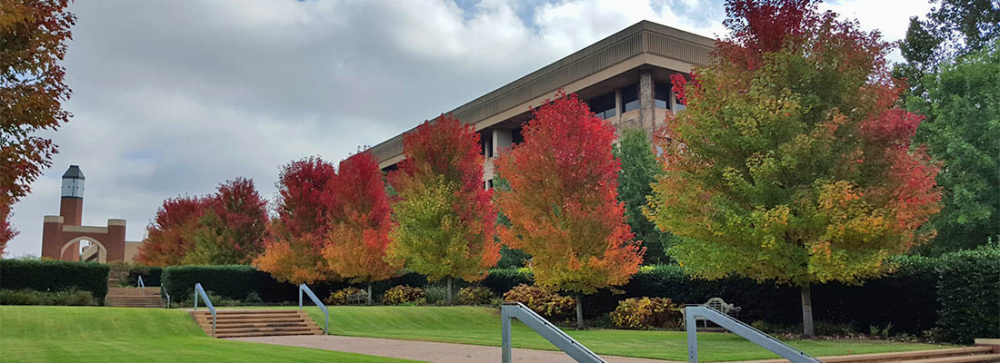

## Liang Genomics Lab @ OUHSC

We want to better understand human diseases, especially cancer, through a combinatorial approach of computational modeling and high-throughput experiments. Research topics of the lab will include: 
1. Developing novel computational biology software, especially for single-cell and spatial genomics;
2. Creative and knowledge-driven data mining;
3. Developing high-throughput molecular biology and cell biology experiments.

Please find our research articles and software. We are open to discussions and collaborations. 

We are building a team of scholars working in **Genomics** and **Computational Biology**. If you are interested, please contact the PI. 

We strive to develop [transparent and scalable methods](pages/software.html), and apply these methods to answer questions in biology and medicine.

We are looking for motivated students and postdocs to join us.  If you are interested, please contact the PI. 

 
