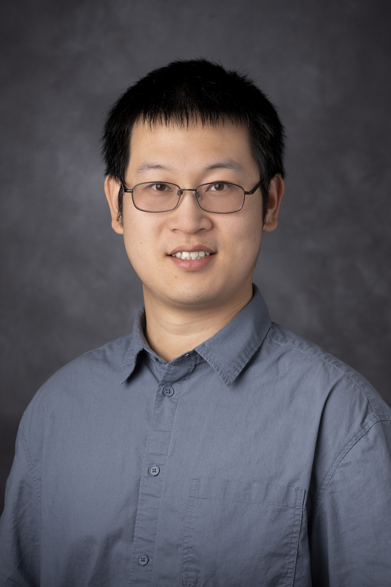

    

        
        

            
        

        

            <h3>Qingnan Liang</h3> 
            Assistant Professor   	    
	    <a href="https://medicine.ouhsc.edu/academic-departments/molecular-genetics-and-genome-sciences">Department of Molecular Genetics and Genome Sciences</a> 	     
            <a href="https://www.ouhealth.com/stephenson-cancer-center/cancer-research/">Stephenson Cancer Center</a> 	    
	    <a href="../assets/CV_QingnanLiang_202606.pdf">Download my CV</a> 
	    My Email: qingnan-liang@ou.edu or qliang2016@gmail.com
        

    

We are seeking multiple roles to lead projects in genomics and computational biology. We will offer lab members stable funding support and individualized mentorships tailored to career plans. We are committed to supporting lab members to stand out in the academic community and build their own networks through pursuing serious and high-quality research publications, actively applying to external fellowships and grants, and establishing collaborations with top-tier scientists.

**Postdoctoral scholar**: Candidates are expected to: 1. Have or will obtain a Ph.D. degree in genetics, genomics, bioinformatics, or relevant fields; 2. Can use LINUX system, and program with Python, R, or other programming languages. Experiences in 1. Developing bioinformatics algorithms; 2. Analyzing single-cell or spatial omics datasets; or 3. Developing or applying high- throughput screening methods (e.g., CRISPR screen) will be favored but not required. This position is open immediately.

**Graduate student (Ph.D.)**: Students who want to start in mid-2027 are expected to: 1. Have or will obtain a bachelor’s degree in genetics, genomics, bioinformatics, or relevant fields; 2. Have research experiences related to bioinformatics and genomics. Master’s degree-level research experiences will be favored.
If you are currently enrolled in the Graduate Program in Biomedical Sciences program (2026 incoming) of OU Health Campus (OUHC), and can do a lab rotation, please contact Qingnan directly.

**Research assistant**: We have RA positions open immediately. The prerequisite is similar to that of incoming Ph.D. students.

**How to apply**: Please send your CV and the names of at least 2 referees to Qingnan: qingnan-liang@ou.edu. A paragraph describing your desired future research topics/fields/projects is optional but favored.

 

 

### Alumni

Name | Year of Departure | Position in Lab | Position after Lab
:----|:------------------|:----------------|:------------------

